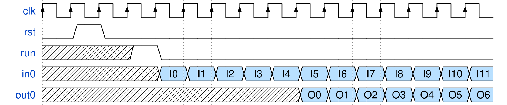
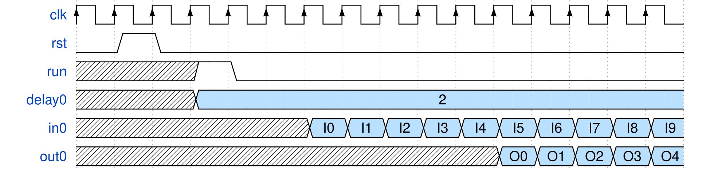

# Versat2.0 Verilog FUs
Versat2.0 supports custom made functional units (FUs) descripbed in verilog. The
custom FUs need to implement the specific interface described in this document.

## Custom FU Ports
The custom verilog FUs can have the following types of signals:
- clk: input clock
- rst: input reset high
- run: input signal start of FU operation for 1 clock cycle
- inX: (optional) input data port
- outX: (optional) output data port
- config: (optional) input FU configuration
- state: (optional) output FU state/flag
- memory map: (optional) input/output interface with CPU
- IO: (optional) input/output interface with other system components
- done: (optional) output signaling operation completion

### Required Ports
All verilog FUs require `clk`, `rst`, and `run` signals. 
The `clk` is the input clock signal from the versat instance. 
The `rst` is an input signal that resets the FU when high (1).
The `run` is an input signal that signals the start of FU operation.

### Input Data Ports
If a custom FU requires `n` input data, it should have `n` input ports named:
`in0, in1, (...), in[n-1]` respectively.
Each input port can have an independent data width.
The input data is assumed valid starting from the cycle **after** `run` is set
high (1) until a new `run` or `rst` signal is received.

### Output Data Ports
If a custom FU requires `n` output data, it should have `n` output ports named:
`out0, out1, (...), out[n-1]` respectively.
Each output port can have an independent data width.
The output data is assumed valid starting from `l` cycles after `run` is set
high (1) until a new `run` or `rst` signal is received.
The `l` cycles corresponds to the FU's `latency` property: the number of cycles
that takes to output a valid results since starting execution.

### Config Ports
If a custom FU requires specific configuration values, it should have one port
for each configuration value. 
These ports can have any name or data width set by the developer.
The configuration values are constant since `run` is set high (1), until Versat
finishes execution.

#### Delay Configuration
One configuration port name is reserved for the `delay0` configuration.
This configuration offsets the FU execution `delay0` clock cycles after the
`run` signal is received.
This configuration value is automatically calculated by Versat2.0 to order the 
FU executions for a particular datapath.
For example, if `FU B` receives an input from `FU A`, each executin, `FU B`
needs to stall until the value from `FU A` is ready.

### State Ports
If a custom FU needs to make states directly available to the CPU, it
should have one port for each state.
These ports can have any name or data with set by the developer.

### Memory Map Ports
Memory Map ports implement a native IOb interface for direct access between the
custom FU and the system CPU.
The memory map port names and widths are the same as the native IOb default
values:
- valid: input signal, 1 bit width
- address: input signal, ADDR_W bit width
- wdata: input signal, DATA_W bit width
- wstrb: input signal, DATA_W/8 bit width
- rdata: output signal, DATA_W bit width
- ready: output signal, 1 bit width

### IO Ports
If a custom FU needs to interface with other system peripherals, it should
implement an IO port map.
IO Ports are associated with comunication protocols that can have variable
response times. 
Implemente a `done` port to ensure that a comunication is completed before
Versat2.0 execution finishes a particular execution.

#### Done Port
The `done` port is an optional output 1 bit signal that Versat checks for
execution completion.
Versat only completes a particular execution when all FUs that implement a
`done` port are set high (1).

## Example Diagrams

### Simple FU
The following figure presents a waveform diagram for a simple FU with one input
and output port and a latency of 5 cycles.

The `run` signal is set high (1) for one cycle only.
The FU `in0` input data starts being received the next cycle.
The FU starts outputing valid data after 5 cycles.
The FU continues operating until the Versat execution finishes.

### Delay FU
The following figure presents a waveform diagram for a FU with one input and
output port, a latency of 5 cycles and a delay0 configuration.

The `run` signal is set high (1) for one cycle only.
The `delay0` configuration is 2, therefore the FU `in0` input data starts being received 2 cycles after the `run` signal.
The FU starts outputing valid data 5 cycles after the delay.
The FU continues operating until the Versat execution finishes.

